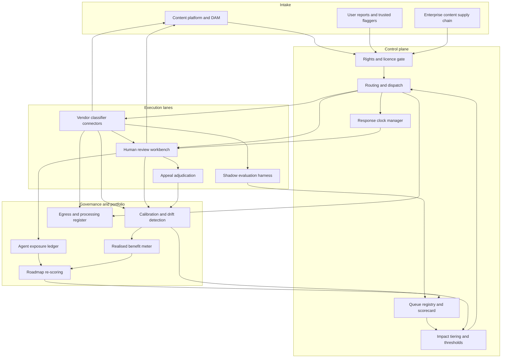

# Threshwork

**Source:** `ai-in-content/Accenture-AI-In-Content-Services/`
**Domain:** `ai-content`
**One-liner:** An automation portfolio control plane for content operations that scores every review queue, sets the confidence threshold at which a machine decision may stand without a human, and meters what each vendor classifier actually delivers per queue against the business case that funded it.
**Wedge:** Content operations running ten or more distinct task queues at scale — trust and safety review at platforms, plus enterprise content supply chains covering catalogue tagging, localisation QA, and accessibility remediation — where a BPO headcount contract and a classifier vendor contract already sit side by side and nobody reconciles them.
**Positioning:** Automation portfolio management for content operations. Vendors sell classifiers, BPOs sell agent hours, and consultants sell the roadmap once. Nobody owns the standing, per-queue decision of which work a machine may finish and which a human must finish, nor the evidence that the choice made at pilot is still the right one two regulatory cycles later. Threshwork owns that decision as a governed, revisable, auditable asset.

## Market research synthesis

### Thesis from source

The source opens on volume rather than on technology. It counts 1.9 billion pieces of content shared daily on Facebook, 14 million images on Pinterest, 500 million tweets, and 500 hours of video uploaded to YouTube every minute during 2016, then makes the operational point that follows from those numbers: scaling content operations with ever more human agents is arithmetically insufficient. Twitter is cited as running AI across every one of the 456,000 tweets sent each minute. The document's framing of the resolution is deliberately not "replace the agents" — it argues for a "bionic" operation in which lower-level tasks are automated away rapidly while humans stay in the mix on the higher value-added and more nuanced activities. That is a division-of-labour thesis, and it implies a standing decision about where the line falls.

The paper's actual contribution is a three-step roadmap — WHY, WHERE, HOW — and the middle step is the one with commercial teeth. Step 1 asks a company to identify and weight the drivers pushing it toward automation (cost, intellectual property, projected growth, regulatory and governmental pressure, competitive pressure) alongside the constraints holding it back (prior automation investments and how they went, the maturity and stability of current operations, C-suite preconceptions, and the benchmarks any business case must meet). The document is explicit about one constraint in particular: if workflows are not codified and optimised, there is "a risk of throwing automation against bad process." Step 2 is an operational scorecard applied task by task, across three criteria buckets — capacity and anticipated future demand, a continuum of difficulty, and importance and impact — with weightings agreed before scores are assigned, producing "an objective, quantified toolkit with which to assign a ranking and order for automation." Step 3 is deployment method: buy versus build, custom versus off-the-shelf, pilot versus scaled, and human replacement versus human-in-the-loop.

Each scorecard criterion carries a specific operational meaning the product must respect. On capacity, the source points at queues struggling to meet current average handling time targets or quality thresholds, and insists that anticipated future volume be scored alongside current load. On difficulty, it draws the distinction that matters most commercially: ideal candidates are tasks that are difficult or time-consuming for humans but relatively easy for off-the-shelf classifiers, while tasks that look trivial to humans — identifying groups of objects, or objects partially obscured behind other elements in a scene — remain notoriously difficult for current classifiers, and ambiguity in policy definition is itself an indicator of difficulty. On impact, it draws the asymmetry plainly: a failure in a policy review queue that allows hate speech onto a platform has a far greater negative consequence than a failure to correctly tag a product image. Those two sentences together are the design brief for tiered thresholds — the same classifier confidence must mean different things in different queues.

Two further passages establish that this is a portfolio that decays rather than a project that completes. First, the regulatory clock: European Commission pressure to auto-flag illegal content is described as placing immediate and significant pressure on companies to find scalable solutions to hate speech and other illegal content before tighter regulation and penalties arrive, and Twitter is reported as having had algorithms flag 95 percent of the nearly 300,000 terrorism-related accounts it removed in a six-month period, with 75 percent removed before their first post. Second, the supply side: the vendor landscape is mapped as tech giants with broad toolkits (Microsoft, AWS, IBM, GCP) against niche startups (Clarifai, Besedo, CloudSight, Community Sift, Imagga, Sight Engine, Cortexica, Arbitrum) spread unevenly across ingest, moderation, tagging, and custom training, in what the document calls an increasingly crowded industry that is difficult to keep up with. The paper closes by warning that customers, regulators, and competitive dynamics can shift radically during the journey, requiring frequent reassessment of priorities and a refreshed roadmap. A scorecard that is produced once and lives in a deck cannot satisfy that requirement. A scorecard that is a live operational object can.

### Buyer & economic model

- **Primary buyer:** VP or Director of Content Operations at a platform, or Global Head of Trust and Safety Operations; in enterprise content supply chains, the operations lead reporting to the Chief Content Officer. The economic sponsor is usually the COO who signed the automation business case and will be asked at the next budget cycle whether it paid.
- **Users:** queue managers and workforce planners (daily), review agents across moderation, tagging, localisation QA and accessibility remediation (continuously), vendor and sourcing managers (monthly and at renewal), quality and calibration analysts (weekly), policy and regulatory affairs leads (on every policy or statute change), and the finance analyst who owns the automation business case (quarterly).
- **Budget owner / value metric:** the content operations cost line, which combines agent hours with classifier API spend. The value metric is cost per reviewed item at constant quality, measured per queue, with deflection rate held separately per impact tier so that savings in low-impact enrichment queues cannot be used to disguise unsafe automation in policy queues. Secondary metrics are statutory clock compliance and measured agent exposure to harmful material.
- **Competing status quo:** a weighted scorecard built once during a consulting engagement and never re-run; per-vendor dashboards reporting each vendor's own accuracy on the vendor's own benchmark; a BPO's average handling time reporting; and a quarterly calibration session whose conclusions never reach the routing configuration. Because nothing reconciles these, routing rules ossify at whatever the pilot concluded, and the operation discovers a drifted classifier through a regulator or a press cycle.

### Domain constraints

- **Regulatory / trust / safety:** statutory removal deadlines and auto-flagging expectations for illegal content, of the kind the source describes arriving from the European Commission; user rights of appeal and redress against an actioned item, which require that any machine decision be reversible by a different human; demonstrable human involvement in high-impact policy decisions; accessibility obligations where a wrong automated caption or alt text is itself a conformance failure rather than a quality defect; and digital asset rights, where publishing an asset whose licence has lapsed is a legal event that no moderation score can excuse.
- **Data sensitivity:** the harmful-content corpora used for calibration are themselves restricted material requiring access logging and handling rules; agent exposure to graphic content is an occupational health matter that must be measured and capped rather than optimised against; enterprise client content carries confidentiality terms and territorial residency restrictions; and every call to a third-party classifier is an egress of customer content that must be governed per queue by processing terms and recorded well enough to answer a client or a supervisory authority precisely.
- **Change-management realities:** the source's warning against throwing automation against bad process is the binding constraint — queues whose policy definitions or taxonomies are unstable will not yield to automation regardless of classifier quality, and attempting it burns the sponsor's confidence. C-suite preconceptions formed by earlier failed automation investments set the risk appetite. Agents must be redeployed onto the hard residual tail rather than simply removed, or quality on the difficult cases collapses while the headline deflection rate looks excellent. And because the vendor landscape churns as fast as the source describes, every deployment choice must be reversible within a shift.

## Business requirements

- BR-1: Every task queue in the operation carries a live, versioned automation scorecard covering capacity and anticipated demand, task and automation difficulty, and importance and impact, with weightings agreed and recorded before any score is assigned; no automation may be deployed into a queue that has not been scored and signed off.
- BR-2: Each queue must declare an impact tier, and the confidence threshold above which a machine decision stands without a human must be set by that tier — a queue where a failure admits illegal or policy-violating content and a queue where a failure mis-tags a product image may never share a threshold.
- BR-3: The business case that justified each automation investment must remain measurable after go-live on the benchmarks it was approved against, and the platform must report realised against promised benefit per queue rather than aggregate programme savings.
- BR-4: Queues whose policy definition or taxonomy is unstable must be blocked from automation until the definition is stabilised and version-pinned, so that the operation cannot automate against a broken process.
- BR-5: Vendor performance must be measured on the operation's own labelled sample drawn from the operation's own queue, never on the vendor's benchmark, and two or more vendors must be runnable in shadow on live traffic before any commitment.
- BR-6: Moving a queue between vendors, or reverting it from machine-final to human-final decisioning, must be an operational action completable within a shift with a defined rollback window, and no queue may run in production without a tested fallback route.
- BR-7: Statutory and contractual response clocks — removal deadlines, localisation SLAs, accessibility remediation windows — must be tracked per item, and items at risk of breach must pre-empt lower-priority work automatically rather than through a supervisor's intervention.
- BR-8: Every automated decision must be reversible through a user- or client-facing appeal, and every appeal must be adjudicated by a human who did not make the original decision.
- BR-9: Agent exposure to graphic and harmful material must be measured per person and capped by policy, and reduction of that exposure must carry explicit weight in automation prioritisation alongside cost.
- BR-10: Content leaving the operation's boundary for a third-party classifier must be governed per queue by processing terms and territorial residency rules, with a record of what was sent where, sufficient to answer a client or supervisory authority without a forensic exercise.
- BR-11: Assets whose licence or usage right has expired, or whose rights status is unverified, must be blocked from publication and from enrichment routing regardless of any quality or moderation score.
- BR-12: The automation roadmap must be re-scored on a fixed cadence and on defined triggers — regulatory change, sustained volume movement outside an agreed band, or a material vendor capability change — with each change and its rationale recorded for the executive sponsor.

## User stories

Canonical user stories live in sibling [USER_STORIES.md](USER_STORIES.md).

## System design

### Overview

Threshwork sits above the content operation's work queues and beneath nothing — it is neither a classifier nor a labour marketplace. Items arrive from the platform's ingest, from user reports, or from a client's content supply chain. Threshwork resolves which queue the item belongs to, checks the rights gate, evaluates that queue's active routing policy (which vendors, in what order, at what confidence threshold, under which processing terms, against which clock), dispatches to classifiers and humans accordingly, and records the decision with the evidence that produced it. Around that runtime sits the portfolio layer that gives the product its reason to exist: the scorecard that ranks queues for automation on agreed weightings, the shadow harness that measures vendors on the operation's own labelled sample before a single item of live traffic moves, the benefit meter that holds each deployment to the business case that funded it, and the governance gate that approves, suspends, or reverts automation queue by queue. The runtime makes the operation work today; the portfolio layer is what stops the pilot's conclusions from quietly becoming permanent.

### Actors & boundaries

- **Actors:** content operations director, queue manager and workforce planner, review agent (moderation, tagging, localisation QA, accessibility remediation), vendor and sourcing manager, policy and regulatory affairs lead, quality and calibration analyst, external classifier vendors, and the end user or enterprise client whose content is being decided upon.
- **Trust boundary:** routing policy, the decision record, the calibration corpus, and the appeal path stay inside the operation. Classifier vendors are untrusted advisors that receive only the minimum content the queue's processing terms permit and return a score; their output is evidence, never authority. The record of what was sent to which vendor under which terms never leaves the operation, because it is the artefact that answers the client and the supervisory authority.
- **Human-in-the-loop points:** threshold-triggered review on every queue at its tier's confidence floor; mandatory human adjudication of all appeals by a different reviewer than the original; governance approval before automation goes live on a queue and before any threshold is loosened; calibration sampling of machine-final decisions; sign-off on any vendor cutover that changes which third party processes a client's content.

### Core capabilities

1. **Queue registry and operational scorecard** — every queue registered with its policy definition version, taxonomy version, volume profile, handling time and quality targets, and a weighted score across capacity, difficulty, and impact.
2. **Impact tiering and threshold policy** — impact tier assignment per queue, and the confidence threshold, sampling rate, and escalation rule that the tier mandates.
3. **Routing and dispatch** — the machine lane, the human lane, and the joint lane where a classifier proposes and a human disposes, selected per item against the queue's live policy.
4. **Vendor shadow evaluation and bake-off** — running candidate vendors against the operation's labelled golden set and against live traffic without acting on the result, producing a comparison on the operation's own data.
5. **Realised benefit metering** — holding each deployment against the baseline and benchmarks in its funding business case, per queue.
6. **Response clock and SLA management** — statutory removal windows, localisation turnaround commitments, and accessibility remediation deadlines tracked per item with pre-emptive escalation.
7. **Appeals and reversal** — reversal of any machine decision by a different human, with the overturn feeding calibration.
8. **Calibration and drift detection** — sampled re-review of machine-final decisions, per-vendor accuracy tracking against contracted floors, and automatic threshold tightening or traffic pullback on drift.
9. **Rights and licence gating** — blocking assets with expired or unverified usage rights from publication and from enrichment routing.
10. **Exposure management** — per-agent measurement of graphic content handling against policy caps, feeding both scheduling and automation prioritisation.
11. **Egress and processing governance** — per-queue processing terms, territorial routing restrictions, and a record of every content egress.
12. **Roadmap re-scoring** — scheduled and trigger-driven re-run of the scorecard with a recorded change history for the executive sponsor.

### Conceptual data

- **Primary entities:** Queue, QueueScorecard, ThresholdPolicy, PolicyDefinition, WorkItem, RightsRecord, RoutingDecision, VendorConnector, VendorEvaluation, GoldenSet, HumanReview, Appeal, ResponseClock, BenefitRecord, ExposureLedgerEntry, EgressRecord, RoadmapEntry.
- **Critical events:** item enqueued and rights-gated; routing policy applied; classifier scored; machine decision finalised or escalated; human decision recorded; appeal opened, upheld, or rejected; response clock breached or pre-empted; vendor drift detected below contracted floor; traffic cut over to a fallback vendor; automation approved, suspended, or reverted on a queue; scorecard re-run; publication blocked on licence expiry.
- **Retention / audit needs:** decision records with their evidence retained for the appeal and regulatory window applicable in each jurisdiction of operation; egress records retained for the enterprise client's contract term plus the supervisory authority's inspection window; harmful-content calibration samples held only in the restricted store, access-logged, with shorter retention and no bulk export; agent exposure ledgers retained under occupational health rules and never surfaced at individual level in vendor-facing or client-facing reporting; scorecards, threshold changes, and governance approvals held as an immutable change history so the sponsor can see when a decision changed and on whose authority.

### Integrations (conceptual)

- **Systems of record:** the platform's content store and digital asset management system, the workforce management and BPO scheduling system, the policy and standards repository that owns the definitions queues are scored against, the procurement and vendor contract system holding accuracy floors and processing terms, the localisation TMS and translation memory, and the ticketing system through which user redress is delivered.
- **Upstream signals:** user reports and trusted flagger feeds, regulator and law-enforcement notices, volume forecasts from product launch and marketing calendars, licence expiry dates from the rights management system, taxonomy version releases from metadata governance, and vendor capability and pricing changes that trigger a roadmap re-score.
- **Downstream actions:** classifier API calls scoped by queue and territory, work assignment into agent tooling, remove or restrict or label or publish actions returned to the content platform, SLA breach alerts, vendor traffic cutover, usage records that reconcile to the vendor invoice, and a refreshed roadmap delivered to the executive sponsor.

### High-level architecture

Intake and routing run hot, because clocks and queue depth do not wait. The portfolio layer runs cold and deliberately, because scorecards, vendor cutovers, and threshold changes are governance acts. The calibration loop is what joins them: sampled human review of machine-final decisions and every overturned appeal flow back into drift detection, which tightens thresholds and feeds the benefit meter that the next roadmap re-score reads.

### Success metrics

- **Leading:** share of live queues holding a scorecard less than ninety days old; deflection rate per impact tier measured against that tier's ceiling rather than against a blended average; human override rate on machine-final decisions, split by confidence band; share of production queues with a tested fallback vendor; share of vendor cutovers preceded by a completed shadow evaluation on the operation's own golden set; clock-bearing items actioned inside their window; agent exposure hours per person per week against the policy cap.
- **Lagging:** cost per reviewed item at constant quality, reported per queue; realised against promised benefit for every funded automation; appeal overturn rate on machine-final decisions compared with human-final decisions in the same queue; quality score on the residual human tail after automation, proving the hard cases did not degrade while the headline improved; regulator notices and enterprise client SLA credits; vendor concentration as a share of total decisions; elapsed time from a regulatory or volume trigger to a re-scored roadmap in the sponsor's hands.

## OpenAPI skeleton

Human-readable pack skeleton: sibling [openapi.yaml](openapi.yaml).

**Codegen source of truth:** domain specs under [`packages/openapi-core/src/`](packages/openapi-core/src/) (`queues`, `routing`, `vendors`, `portfolio`, plus shared `identity` and `common/`).

Summary:

- **Base path:** `/v1/...` (identity under `/v0/...`)
- **Auth:** `X-API-Key` for server-to-server ingest from the content platform and for vendor connector callbacks; Bearer JWT for console operators, agents, and governance roles.
- **Domains / resource groups:** Queues (registry, scorecards, thresholds, automation approval), Routing (work items, rights, review, appeals, clocks), Vendors (connectors, evaluations, golden sets, cutover), Portfolio (benefits, egress, exposure, roadmap).
