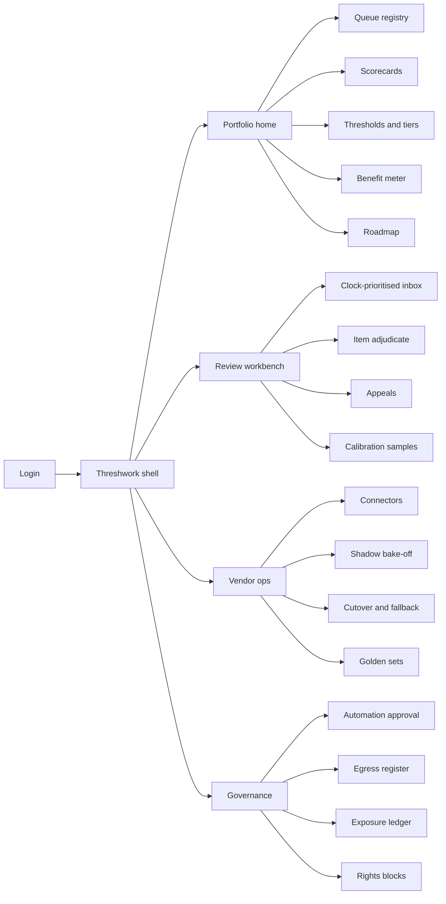
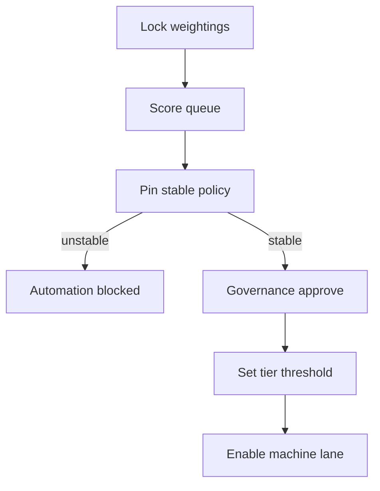
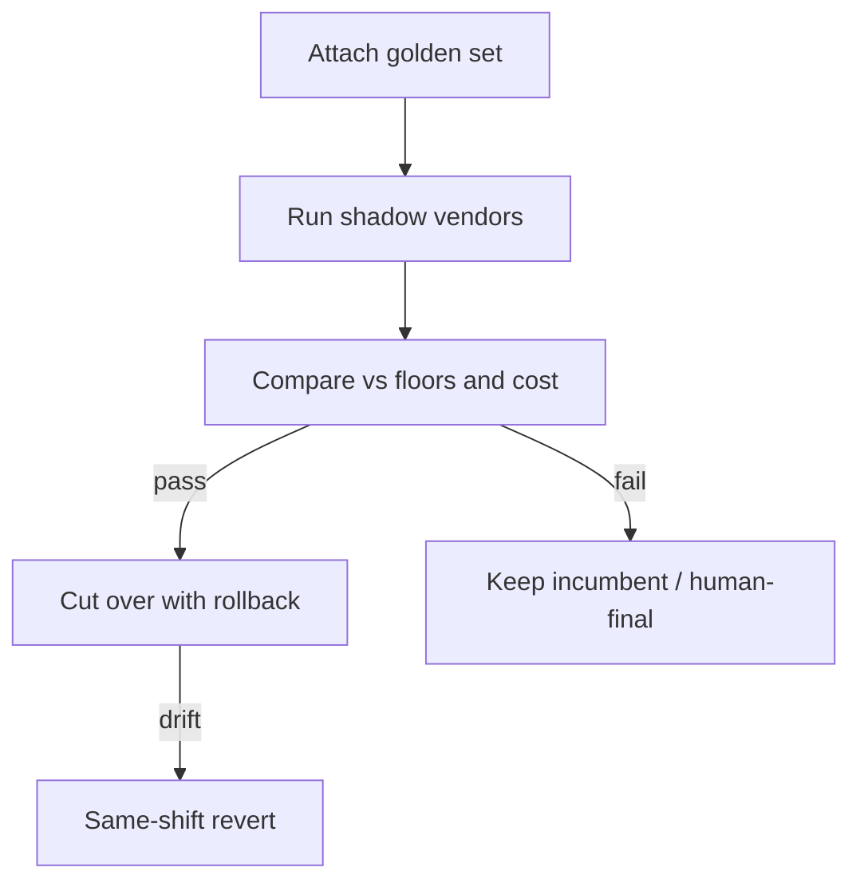
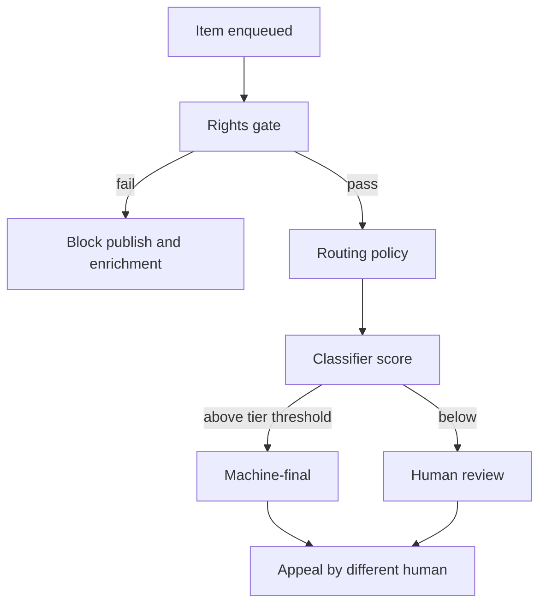

# Threshwork — Web app

**Product:** [PRODUCT.md](./PRODUCT.md)
**Primary surface:** Content operations control plane (portfolio console + review workbench under one Threshwork shell)
**Secondary surfaces:** Regulator / enterprise client period export viewer (read-only decision and egress pack); restricted calibration store viewer (access-logged, no bulk export)
**Design thesis:** Threshwork is the standing decision of where the machine stops and the human starts — not another classifier dashboard. The UI metaphor is a scored portfolio board crossed with a threshold dial: every queue is a ranked, versioned position; every confidence number is meaningless until an impact tier paints the band it sits in. Visual language is cool industrial ink with a hard cyan threshold mark and tier-coloured urgency (policy coral, enrichment steel). Machine-final feels provisional until calibration and clocks agree; human-final and appeals feel deliberate and second-pair. The brand wordmark sits as a quiet threshold bar on every governance and money-of-attention screen so sponsors always know whose line they are trusting.

## UX research synthesis

### Category peers (best-in-class)

- **Hive (Moderation Console):** Dense multi-modal review queues, confidence scores beside media, auto-action thresholds per class. Steal: confidence-as-first-class column and media + model proposal on one plane so agents adjudicate rather than restart; reject Hive’s product gravity toward “the model is the product” — Threshwork’s product is the per-queue threshold and portfolio order, not the classifier itself.
- **Cinder:** Trust-and-safety case management with investigation timelines, role-separated adjudication, and audit-ready case histories. Steal: appeal/case workspace where a second human disposes with full evidence trail; reject generic ticket-desk chrome that buries statutory clocks under SLA badges.
- **Arize AI:** Model performance comparison, drift monitors, and shadow/canary evaluation against production baselines. Steal: side-by-side vendor bake-off on the operation’s own labelled sample and live shadow traffic, with contracted accuracy floors as hard visual rails; reject MLOps experiment gallery aesthetics that invite endless A/B without a cutover action.
- **Labelbox (Annotate / Review):** Human review of model-proposed labels with evidence snippets, disagreement queues, and calibration sampling. Steal: “proposal + confidence + why” workbench pattern for moderation, tagging, localisation QA, and accessibility remediation; reject pure labelling-platform onboarding that assumes ontology design is the job — here the ontology is already owned by policy and must be version-pinned.

### Patterns to adopt / reject

- **Adopt:** Portfolio home ranked by live scorecard, never by vendor demo recency; impact-tier bands that force different threshold floors; unstable-policy block banners that prevent go-live; shadow bake-off before any cutover; realised-vs-promised benefit per queue (not programme roll-up); clock preemption rail that jumps the workbench; second-human appeal path; exposure meters that can block assignment; egress register as a first-class governance nav.
- **Reject:** Blended “automation rate” KPI that mixes hate-speech and colour-tag queues; vendor-native accuracy charts as the selection surface; purple “AI insights” chat as the routing builder; editable historical decision totals; card grids of vanity deflection; dashboard-of-everything as the only home for agents who need a workbench.

### Trust, density, and workflow constraints from PRODUCT.md

Operators need finance-and-regulator density without exposing harmful corpora or agent-level wellbeing data to the wrong audience (BR-9, BR-10): calibration samples live in a restricted store with access logging; exposure ledgers never appear in vendor- or client-facing exports. Automation cannot deploy without a signed scorecard and stable, version-pinned policy (BR-1, BR-4). Impact tiers must make shared thresholds visually impossible (BR-2). Vendor choice rests on the operation’s golden set and shadow traffic, with same-shift rollback (BR-5, BR-6). Statutory clocks pre-empt lower work (BR-7); appeals reverse machine decisions by a different human (BR-8); rights expiry blocks enrichment and publish regardless of quality scores (BR-11). The roadmap is a living object re-scored on cadence and triggers (BR-12), so change history must feel immutable in the chrome.

## Information architecture

### Nav model

### Roles → default home

| Role | Default home | Why |
|------|--------------|-----|
| Content operations director | Portfolio home — ranked queues + realised vs promised | Defend or kill programmes with evidence (BR-3, BR-12) |
| Queue manager / workforce planner | Queue detail — threshold, clocks, residual tail staffing | Daily deflection and breach prevention (BR-2, BR-7) |
| Review agent / language QA / accessibility | Review workbench inbox | Continuous adjudication of proposals |
| Vendor / sourcing manager | Shadow bake-off | Selection on own data before commitment (BR-5) |
| Policy / regulatory affairs | Automation approval + egress register | Block unstable policy; answer clients/authorities (BR-4, BR-10) |
| Quality / calibration analyst | Calibration samples | Drift and golden-set hygiene |
| Finance analyst (automation case) | Benefit meter | Quarterly case truth (BR-3) |

### Cross-links to OpenAPI resources

| Nav area | OpenAPI tags / resources |
|----------|---------------------------|
| Queue registry, policy pin | Queues |
| Scorecards, weightings | Scorecards |
| Thresholds, impact tiers, automation status | Queues, Scorecards, Governance |
| Work items, rights, routing | Routing |
| Review workbench, calibration | Review |
| Appeals | Appeals |
| Connectors, evaluations, golden sets, cutover | Vendors |
| Response clocks / preemption | Clocks |
| Realised benefit | Benefits |
| Automation approval, egress, exposure | Governance |
| Roadmap re-score | Roadmap |

## Screen inventory

### Portfolio home

- **Purpose:** Answer “which queues deserve automation next, and which funded automations are still earning their case?” in one composition — not a blended programme score.
- **Entry:** Post-login for director / finance; deep link from roadmap alerts or benefit undershoot.
- **Layout regions:** Brand + workspace context (top); portfolio rank table (capacity × difficulty × impact with recorded weightings); impact-tier legend; benefit sparklines per queue (promised vs realised); alerts rail (unstable policy blocks, drift pullbacks, clocks at risk, scorecards older than ninety days).
- **Primary actions:** Open queue scorecard; trigger roadmap re-score; export sponsor pack; jump to undershooting benefit queues.
- **Empty / loading / error:** Empty = register first queue + agree weightings before any score; loading = skeleton rank rows; error = retry with request id.
- **BR / story ties:** BR-1, BR-3, BR-12; director stories on defensible order and volume modelling.

### Queue registry and scorecard

- **Purpose:** Register each task queue with pinned policy/taxonomy versions and a live weighted scorecard; block automation when process is bad.
- **Entry:** Portfolio nav → Queues; create from home CTA.
- **Layout regions:** Filterable queue table (impact tier, automation status, score age, fallback vendor health); detail panes: policy definition pin + stability flag, volume and AHT targets, anticipated demand, scorecard editor (capacity / difficulty / impact with weightings locked before scores), governance status chip.
- **Primary actions:** Pin policy version; record weightings then score; mark unstable (blocks approval); open threshold policy; open benefit record.
- **Empty / loading / error:** Empty = guided register for moderation vs enrichment queues; validation = cannot score until weightings signed; conflict = unstable definition with live automation (409 path).
- **BR / story ties:** BR-1, BR-4; director and policy stories.

### Threshold and impact tier policy

- **Purpose:** Make the confidence line an explicit, tier-bound policy object so hate-speech and garment-colour queues can never share a floor.
- **Entry:** Queue detail → Thresholds; queue manager default deep link.
- **Layout regions:** Tier assignment (policy / high / medium / enrichment); threshold dial with hard band from tier; sampling rate for machine-final; escalation rule; preview of “at this confidence, what share would go machine-final on last week’s distribution.”
- **Primary actions:** Save draft; submit for governance approval; tighten on drift; compare to peer queues in same tier only.
- **Empty / loading / error:** No tier = blocking banner; loosening without approval = refused with recorded reason.
- **BR / story ties:** BR-2; queue manager stories on threshold by impact.

### Clock operations board

- **Purpose:** Surface statutory removal windows and contractual SLAs so at-risk items pre-empt lower-priority work without a supervisor hunt.
- **Entry:** Review shell clock rail; ops nav shortcut; alert from breach forecast.
- **Layout regions:** Horizon strip (items inside breach window); queue depth by clock class; preemption log; link-out to workbench filtered to clock-bearing items.
- **Primary actions:** Preempt item into agent inbox; snooze only with policy reason where allowed; open rights-blocked siblings separately.
- **Empty / loading / error:** Empty = healthy clocks message; error = clock source sync failure as blocking banner.
- **BR / story ties:** BR-7; queue manager stories on breach as a choice.

### Human review workbench

- **Purpose:** Let agents adjudicate a machine proposal with confidence and evidence — not restart every item from zero — across moderation, tagging, localisation QA, and accessibility remediation.
- **Entry:** Agent login default; preempted clock items land at top.
- **Layout regions:** Prioritised inbox (clock first, then residual hard tail); item stage with media/text, classifier proposal, confidence band coloured by queue tier, evidence snippets, rights status; decision controls; exposure meter for graphic queues; optional “systematic miss” flag into calibration.
- **Primary actions:** Accept / amend / override proposal; escalate; flag class error; pause when exposure cap nears.
- **Empty / loading / error:** Empty = no items (show residual-tail redeploy hint); media load fail = retry without losing proposal context; exposure cap hit = assignment blocked with wellbeing copy.
- **BR / story ties:** BR-8 adjacency, BR-9; agent and language QA stories.
- **Mobile notes:** Read and decide on tablet for overflow shifts; full media scrubbing remains desktop-primary.

### Appeals adjudication

- **Purpose:** Reverse any machine (or original) decision with a different human, feeding overturns into calibration.
- **Entry:** Appeals nav; user/client redress deep link; policy period export drill-in.
- **Layout regions:** Appeal queue; dual pane — original decision + evidence vs appellant claim; assignee must differ from original reviewer (enforced); overturn impact on calibration and benefit.
- **Primary actions:** Uphold; overturn with reason; request more evidence; lock when window closes.
- **Empty / loading / error:** Empty = no open appeals; assignment conflict if same human = hard block.
- **BR / story ties:** BR-8; policy lead period-record story.

### Vendor shadow bake-off

- **Purpose:** Run two or more vendors on the operation’s golden set and live shadow traffic without acting, so selection rests on own data — not vendor benchmarks.
- **Entry:** Vendor ops default for sourcing; from queue “change vendor” intent.
- **Layout regions:** Vendor picker; golden-set coverage; live shadow parity chart (precision/recall or agreed queue metric vs contracted floor); cost-per-decision including residual human handling; territory/processing-terms fit matrix.
- **Primary actions:** Start shadow; stop; promote winner to cutover draft; export bake-off pack for procurement.
- **Empty / loading / error:** Empty = attach golden set first; insufficient sample = cannot promote; vendor API fail = marked in comparison, not silently dropped.
- **BR / story ties:** BR-5; sourcing manager stories.

### Vendor connectors and cutover

- **Purpose:** Complete same-shift cutover or revert to human-final / fallback vendor with a tested rollback window.
- **Entry:** After bake-off promote; vendor nav → Cutover; drift alert CTA.
- **Layout regions:** Active routing order per queue; fallback health; processing terms and residency; cutover checklist (shadow complete, approval, rollback window); traffic share slider with confirm.
- **Primary actions:** Cut over; revert within window; suspend automation to human-final; open egress implications.
- **Empty / loading / error:** No tested fallback = cutover blocked (BR-6); mid-cutover failure = auto-rollback banner.
- **BR / story ties:** BR-6, BR-10; sourcing failover story.

### Benefit meter

- **Purpose:** Hold each deployment to the business case that funded it — realised vs promised per queue, never programme camouflage.
- **Entry:** Portfolio home; finance role home; director budget-cycle pack.
- **Layout regions:** Case baseline (cost per reviewed item, quality floor, exposure reduction weight); realised series; deflection by impact tier with tier ceilings; residual-tail quality so hard cases cannot silently degrade.
- **Primary actions:** Export case defence pack; flag kill/keep recommendation; open related scorecard re-score.
- **Empty / loading / error:** No linked case = queue cannot show “funded” state; loading = skeleton series.
- **BR / story ties:** BR-3, BR-9 weight; director and finance stories.

### Governance: automation approval, egress, exposure

- **Purpose:** Approve, refuse, or suspend automation with recorded rationale; prove what left the boundary; cap agent graphic exposure.
- **Entry:** Policy lead home; governance nav; approval required gate from threshold save.
- **Layout regions:** Approval queue (approve / refuse / suspend / revert) with immutable reason log; egress register (what sent where under which terms — answer-ready); exposure ledger (per-agent vs policy cap, scheduling feed) with privacy chrome for non-HR viewers.
- **Primary actions:** Approve/refuse automation; export egress answer pack; adjust exposure cap policy; block assignment near cap.
- **Empty / loading / error:** Empty approval queue = healthy; egress query miss = structured “no transfers in window.”
- **BR / story ties:** BR-4, BR-9, BR-10; policy stories on territorial routing.

### Rights and licence blocks

- **Purpose:** Stop expired or unverified assets from publication and enrichment routing regardless of classifier scores.
- **Entry:** Governance; workbench when rights gate fails; DAM sync alerts.
- **Layout regions:** Blocked-asset list; rights record detail; routing attempts denied log; release only when rights system clears.
- **Primary actions:** Acknowledge block; request rights refresh; exclude from enrichment queues.
- **Empty / loading / error:** Empty = no active blocks; sync lag = provisional hold state.
- **BR / story ties:** BR-11.

### Roadmap re-scoring

- **Purpose:** Re-run the portfolio scorecard on cadence and triggers (regulatory change, volume band break, vendor capability shift) with change history for the sponsor.
- **Entry:** Portfolio home; scheduled job; trigger from policy or vendor events.
- **Layout regions:** Trigger list; before/after rank diff; recorded rationale; sponsor-facing summary; link to queues whose automation status should change.
- **Primary actions:** Run re-score; publish to sponsor; open affected threshold reviews.
- **Empty / loading / error:** First run = seed from current scorecards; partial failure = show which queues unscored.
- **BR / story ties:** BR-12; director modelling story.

### Calibration and drift

- **Purpose:** Sample machine-final decisions, detect vendor drift below contracted floors, and tighten thresholds or pull traffic automatically.
- **Entry:** Calibration analyst home; workbench “systematic miss” flags; vendor floor breach alerts.
- **Layout regions:** Sample queue; disagreement rate by confidence band; vendor floor rails; auto-action log (tighten / pullback); feed into benefit and roadmap.
- **Primary actions:** Adjudicate sample; promote labels into golden set (restricted store rules); confirm pullback.
- **Empty / loading / error:** Empty = healthy sampling cadence message; restricted-store access denied = clear privilege error.
- **BR / story ties:** BR-5 floors, BR-6 pullback; director traffic pullback story; QA stories.

## Key flows

1. **Score → approve → set threshold → go live** — agree weightings → score queue → pin stable policy → governance approve → set tier threshold → enable routing; failure: unstable policy or missing scorecard blocks approval (BR-1, BR-4).

2. **Shadow bake-off → cutover** — attach golden set → run vendors in shadow on live traffic → compare on own metrics and total cost-per-decision → cut over with tested fallback and rollback window; failure: no fallback or incomplete shadow blocks promote (BR-5, BR-6).

3. **Item lifecycle** — enqueue → rights gate → apply routing policy → classifier and/or human → decision record → optional appeal by different human; failure: rights block or clock preemption reshapes order (BR-7, BR-8, BR-11).

4. **Clock preemption** — item approaches statutory or SLA window → board surfaces → preempt into workbench ahead of lower-priority work; failure: sync loss raises blocking banner rather than silent miss (BR-7).

5. **Drift pullback and re-score** — calibration detects floor breach → auto-tighten or pull to human/fallback → benefit meter updates → roadmap re-score on trigger with sponsor history (BR-6, BR-12).

## Design system

### Tokens (CSS variables)

- `--color-ink: #E6EDF2` — primary text on dark ground
- `--color-ground: #0A0F14` — app ground (industrial ink)
- `--color-panel: #121A22` — panels and scorecard wells
- `--color-rule: #2A3845` — dividers / ledger lines
- `--color-threshold: #2EC4B6` — cyan threshold mark / machine-lane confirm
- `--color-threshold-dim: #1A6B62` — threshold on dark fills
- `--color-tier-policy: #E85D4C` — policy / illegal-content impact (coral)
- `--color-tier-high: #E6A23C` — high-impact amber
- `--color-tier-enrich: #7A9BB0` — enrichment / low-impact steel
- `--color-human: #C4B5A0` — human-final / appeal deliberate tone (cool sand, not cream page)
- `--color-steel: #8FA3B5` — secondary labels
- `--color-brand: #5EE0D2` — Threshwork wordmark accent (quiet cyan bar)
- `--font-display: "Space Grotesk", sans-serif` — portfolio ranks, screen titles, threshold numerals
- `--font-body: "IBM Plex Sans", sans-serif` — console body
- `--font-mono: "IBM Plex Mono", monospace` — confidence scores, clock countdowns, egress ids, scorecard versions
- `--space-1`…`--space-8`: 4px scale
- `--radius-sm: 4px`; `--radius-md: 8px` — control-plane sharp, not pill-heavy
- `--motion-threshold: 160ms ease-out` — dial settle when confidence band commits
- `--motion-clock: 220ms ease-in-out` — coral/amber pulse on breach horizon
- `--motion-pullback: 280ms ease-out` — traffic share animate on cutover/revert
- Atmosphere: fine horizontal rule grid in panel colour (portfolio ledger paper), soft top vignette; no stock “AI brain” imagery; restricted calibration views use a distinct denser ground (`#070B0F`) to signal elevated handling.

### Typography & brand

- Display for portfolio rank indices, threshold percentages, and screen titles; mono for confidence, clock remaining, egress record ids, scorecard version hashes.
- Brand wordmark left of shell chrome with a one-pixel threshold bar underline on governance, benefit, and approval views — never replaced by a generic “Dashboard” as the strongest mark.
- Login / marketing shell: brand as hero-level signal; one headline (“Set the line machines may cross”); one CTA — no KPI strip of blended automation rates.

### Do / don’t

- **Do:** Show impact tier before confidence; lock weightings before scores; treat approved automation status as gated chrome; dual-pane appeals with different-human enforcement; report benefit per queue and deflection per tier ceiling; make rights and unstable-policy blocks impossible to miss.
- **Don’t:** Purple AI glow or chatbot-as-router; blended programme savings as the hero KPI; vendor benchmark charts as the bake-off; editable historical decisions; card grids for static metrics; emoji severity; rounded-full pills on every filter; cream-serif-terracotta “consulting deck” restyling of the scorecard.

### Accessibility & domain trust cues

- Contrast AA+ for cyan / coral / amber on ink ground; never rely on colour alone — tiers also carry text labels (“Policy tier”), and settled governance actions show lock + actor + timestamp.
- Live regions announce clock preemption, drift pullback, and exposure-cap blocks.
- Focus order follows control-plane flow: scorecard → approval → threshold → workbench → appeal.
- Harmful-media screens default to blurred until intentional reveal; exposure warnings use clear language, not gamified streaks.
- Period exports for regulators/clients omit agent-identifying exposure detail and raw harmful samples.

## Component patterns

- **ScorecardRankRow** — weighted capacity / difficulty / impact with score age and automation status.
- **WeightingLock** — must confirm before scores become editable.
- **ImpactTierBand** — visual band that constrains the threshold dial.
- **ThresholdDial** — confidence floor with tier-hard minimum and distribution preview.
- **UnstablePolicyBanner** — settlement-style block on automation approval.
- **ClockHorizonStrip** — breach-window items with preempt action.
- **ProposalEvidencePane** — media/text + model proposal + confidence + evidence for agents.
- **AppealDualPane** — original vs appellant; enforces different adjudicator.
- **ShadowCompareChart** — vendors vs own golden set and contracted floors, plus residual human cost.
- **CutoverChecklist** — shadow done, approval, fallback tested, rollback window.
- **BenefitCaseMeter** — promised vs realised per queue with tier-ceiling deflection.
- **EgressRecordRow** — what / where / terms / territory for authority answers.
- **ExposureMeter** — per-agent vs cap; can block assignment.
- **RightsGateChip** — blocks enrichment and publish regardless of quality score.
- **RoadmapDiff** — before/after portfolio order with recorded trigger and rationale.

## Out of scope for v1 web

- Building or hosting classifier models in-product; BPO agent HRIS replacement; end-user consumer appeal portal UI beyond deep-linked adjudication for operators; native mobile trader-style apps; headset / AR review clients; white-label agency portals for third-party consultancies; real-time raw vendor packet debugger for platform engineers (API/logs only); bulk export of restricted harmful calibration corpora.
